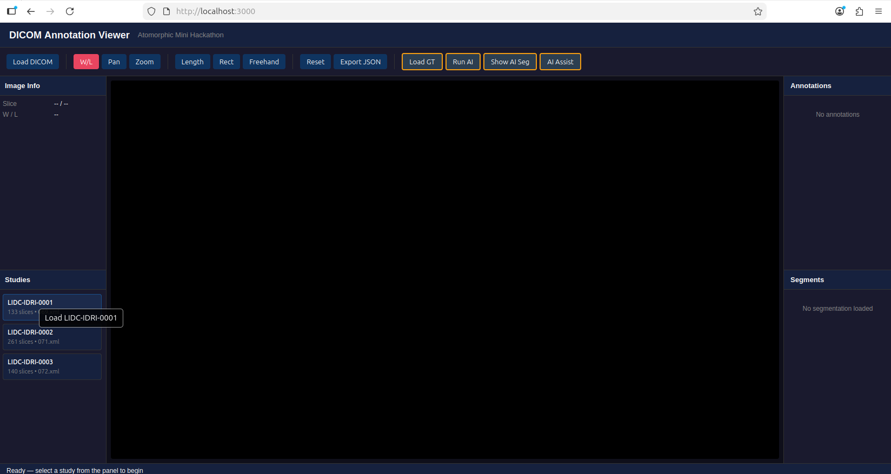
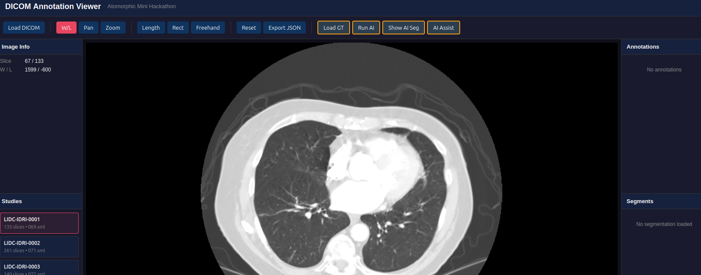
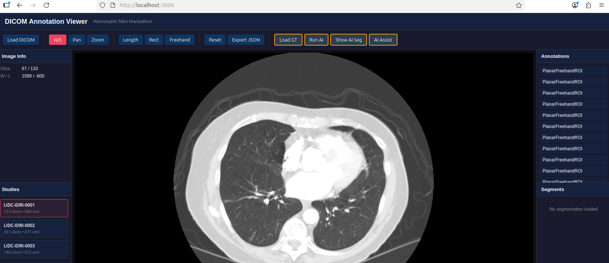
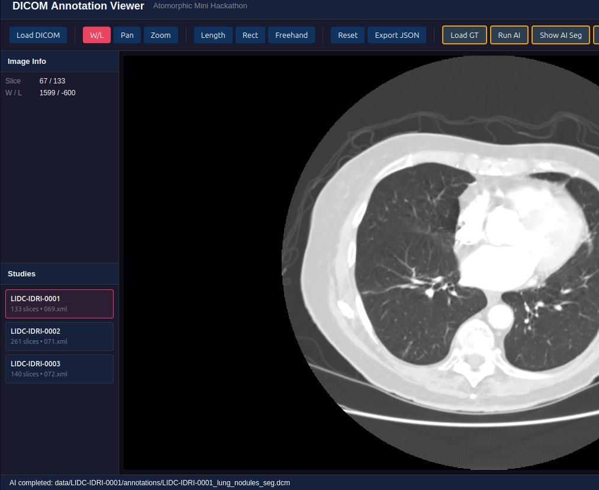
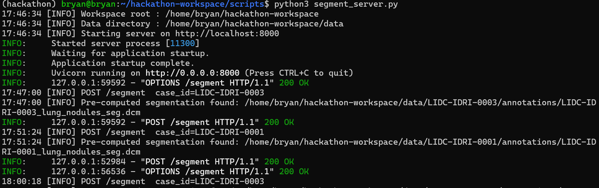
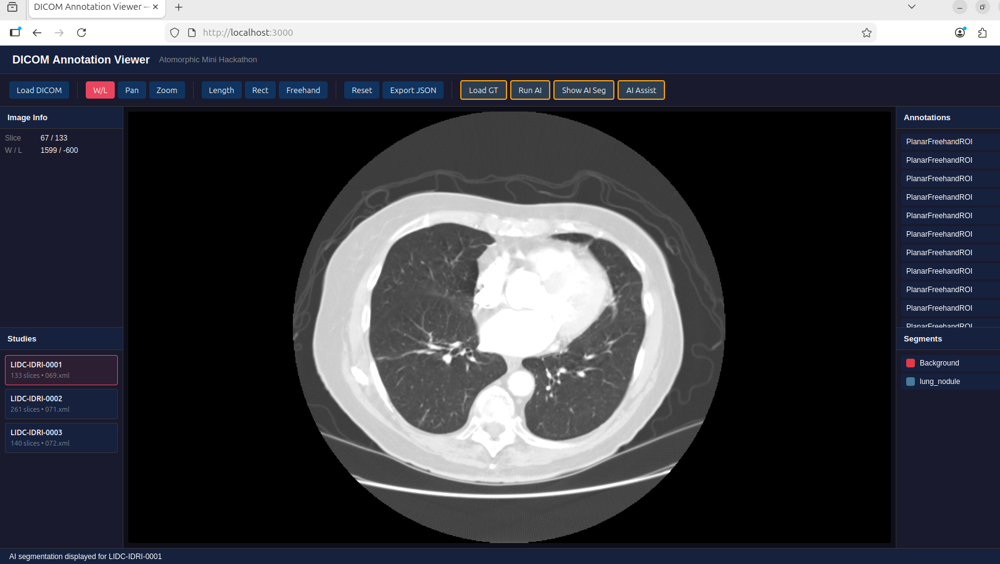

# Hackathon Report — Sim Ying Zhong, Bryan

**Date:** 24 February 2026  
**Coding:** 16:00–18:00  
**Report writing:** 18:00–18:30  
**Tasks completed:** *(e.g. Task 1, Task 2, partial Task 3)*
Task 1 and Task 3 
Partial Task 2 and Task 4

---

## Overview

*What did you build? What was your overall strategy? (3–5 sentences)*
During the hackathon, I exgedned the provided Cornerstone3D DICOM viewer with additional functionality for loading studies, processing annotations, and integrating an AI segmentation model. I implemented a study selector that allows users to browse and load LIDC studies into the viewer and connected the frontend to a backend segmentation API for running an AI model on the selected CT data.

I also attempted to implement ground truth annotation loading from the LIDC XML files and began integrating the display of AI segmentation overlays. While these features were partially implemented, the annotation and segmentation overlays did not fully render due to coordinate alignment and decoding challenges.

My overall strategy was to first complete the study loading workflow (Task 1), then connect the viewer to the segmentation pipeline (Task 3), and finally work on displaying annotations and segmentation overlays.

---

## Tasks

For each task you attempted, briefly describe what you did, what surprised you, and any tradeoffs you made. Skip tasks you did not attempt — or leave a one-line note on why.

### Task 1 — Study Selector
 
I implemented a study selector panel using the provided metadata. Each study was rendered as a clickable element in the sidebar, and selecting a study triggered the loadStudy() function to load its CT slices into the viewer.


The selected study ID was stored in the activeStudy state so that other tasks (such as loading annotations or segmentations) could reference the currently loaded dataset. The UI also updates the viewer status and slice information after loading.

One edge case I considered was switching studies while annotations or segmentations from a previous study were present. To avoid conflicts, I cleared segmentation paths and segment lists when a new study was loaded.

A challenge here was ensuring that the viewer state and UI state remained synchronized after loading a new dataset.

### Task 2 — Load Ground Truth

For Task 2, I attempted to load the LIDC ground truth annotations stored as XML files and convert them into PlanarFreehandROI annotations in Cornerstone3D.

The XML file was fetched from the dataset folder and parsed using the browser DOMParser. Because the XML uses a namespace, namespace-aware queries were used to retrive the elements and their corresponding <edgemap> contour points. 

Each ROI contains a Z-position and a set of pixel coordinates representing the contour. My approach was to convert these pixel coordinates to world coordinates using Cornerstone utilities (such as imageToWorldCoords) and then attach the resulting points to a PlanarFreehandROI annotation.

However, the contours were not successfully rendered in the viewer. The likely issue was related to the coordinate transformation and matching the ROI Z-position to the correct CT slice. Since Cornerstone annotations require world coordinates aligned with the loaded image stack, an incorrect mapping prevented the annotations from appearing.

Due to time constraints, I was not able to fully debug this issue, so the ground truth contours were parsed but not displayed in the viewer.

### Task 3 — Run AI Segmentation
For Task 3, I implemented a connection between the frontend and a backend segmentation service using a FastAPI server provided in the repository.



When the Run AI button is clicked, the application sends a POST request to the segmentation endpoint:
```bash
POST http://localhost:8000/segement
```

The frontend stores this returned path in the aiSegPath state so it can later be loaded and displayed by the viewer.

The main challenge was ensuring proper communication between the frontend and backend, including handling cases where the server is not running or the request fails.

### Task 4 — Display AI Segmentation

For Task 4, I began implementing the logic required to load and display a DICOM SEG segmentation file as an overlay on the CT images.

The goal was to load the segmentation file returned by Task 3 and use the Cornerstone segmentation API to create a labelmap representation that could be rendered on the viewer. This would allow the segmentation masks to appear as colored overlays aligned with the CT slices.

Although I was able to obtain the segmentation file path from the AI segmentation server, the decoding and display of the DICOM SEG file were not fully implemented before the time limit. The main challenge was understanding how to correctly parse the segmentation frames and map them to the existing CT image stack.

As a result, the segmentation overlay functionality remained partially implemented.

### Bonus

---

## Reflection

*Answer any or all of the questions below — or raise your own.*

- What was the hardest part of the challenge?
- What would you do differently if you had more time?
- Was there anything about the codebase or tooling that surprised you?

The most challenging part of the hackathon was working with the coordinate systems used in medical imaging data. The LIDC XML annotations are defined in image pixel coordinates, while the Cornerstone annotation system expects world coordinates in millimetres. Correctly converting between these coordinate systems requires careful use of image metadata such as slice position, pixel spacing, and frame of reference.

Another difficulty was understanding how segmentation data is represented in DICOM SEG format. Unlike standard DICOM images, segmentation files store masks as multi-frame binary data that must be correctly mapped onto the original image stack. This adds an additional layer of complexity when trying to display segmentation overlays.

If I had more time, I would focus on debugging the coordinate conversion logic used when creating the ground truth annotations and implementing a complete DICOM SEG decoding pipeline so the AI segmentation results can be displayed correctly.

Overall, the challenge highlighted how important spatial metadata and coordinate consistency are in medical imaging applications.
---

## AI Usage

*Which tools did you use, and how did you use them? What did you have to verify or correct?*
I used AI tools (primarily Codex) to assist with understanding unfamiliar APIs and exploring potential implementation approaches. AI was particularly useful for explaining how Cornerstone3D annotations work, how to parse XML data in the browser, and how segmentation workflows typically integrate with frontend viewers.

However, the suggestions generated by AI needed to be verified against the official Cornerstone3D documentation. Some implementations required modification to match the structure expected by the existing codebase, especially when working with annotations and coordinate conversions.

AI was therefore helpful as a guide for exploring possible solutions quickly, but manual debugging and verification were still necessary to ensure the code worked correctly within the viewer architecture.